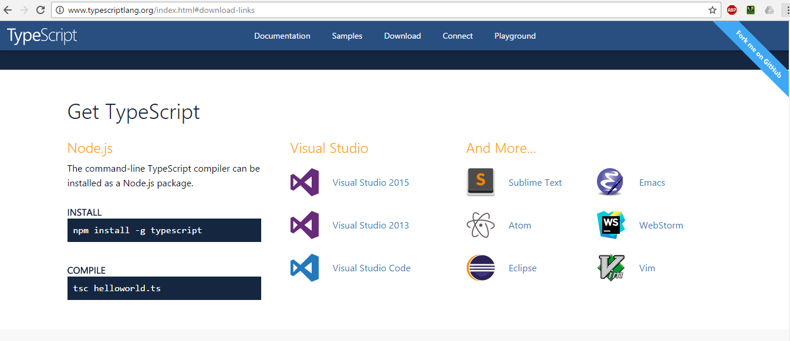
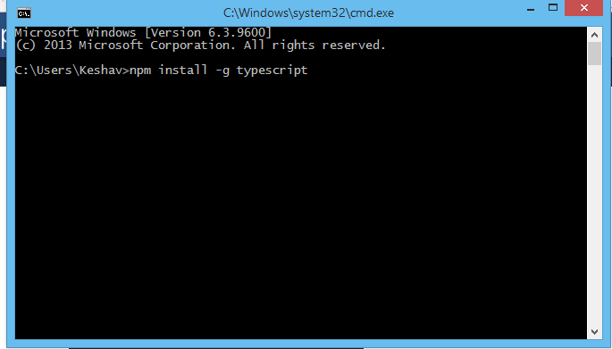
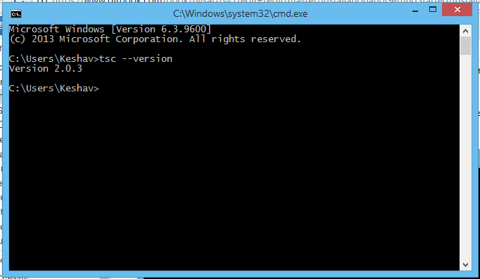
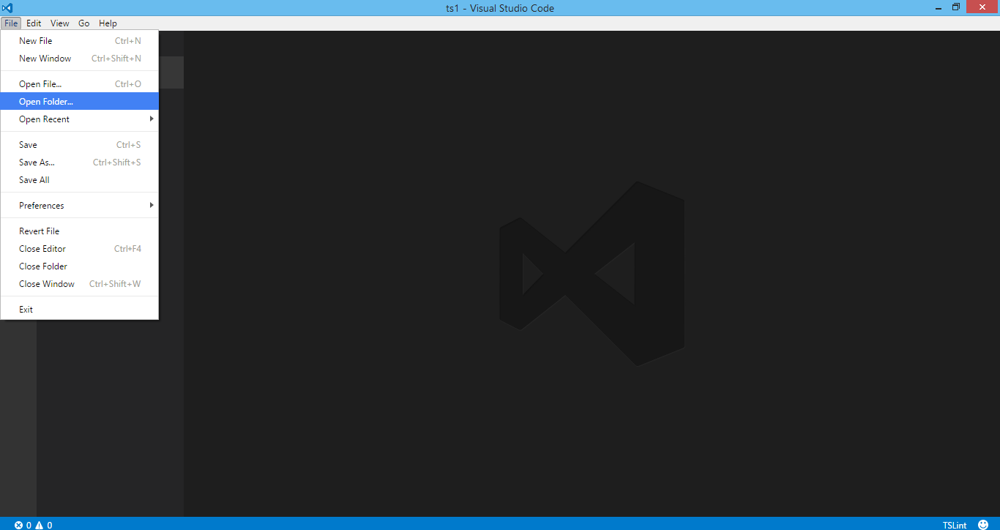

# Installing Typescript

There are a lot of option available to install Typescript. But the best option is go to [http://www.typescriptlang.org](http://www.typescriptlang.org/). Then under the website click on Download button on the top.

You will find a screen like this below.

 
We will install Typescript for  **Visual Studio Code** and **Node**

### Setup Typescript for Node

**Step 1:** Make sure Node is install in your machine. If Node is not in your machine you can get Node from following Website [https://nodejs.org/en](https://nodejs.org/en/).

**Step 2:** Open Command Prompt and install Typescript using NPM. Just type command `npm install -g typescript` and press enter.

**Step 3:** After the installation is complete you can check Typescript version. Type following command in same Command Prompt `tsc --version`

### Setup Typescript for Visual Studio Code

**Step 1:** Make sure we have already installed visual studio code in our machine. If not we can download one from following website [https://code.visualstudio.com](https://code.visualstudio.com)

**Step 2:** Once Visual Studio Code installed in your machine. Open Visual Studio Code

**Step 3:** Create Directory `D:\TypeScript-WorkSpace`

**Step 4:** Open Visual Studio Code and Under Visual Studio Code Open Explorer

Point to the directory we have created just now.