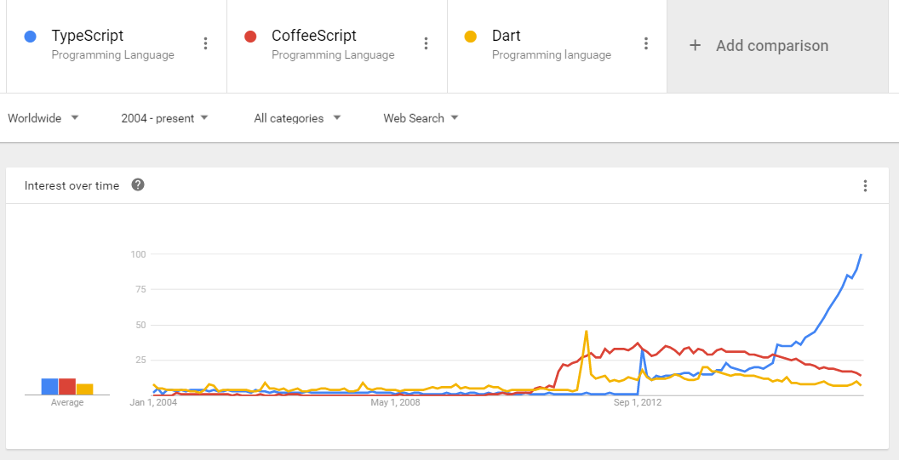

# Object Oriented Programming in Typescript

Typescript is nothing but a Super-set of JavaScript. It is an open source project maintained by Microsoft, and it transpiles into a JavaScript.

Typescript designed for developers who build large and complex apps in JavaScript. It inherits Object Oriented Programming concepts from languages such as C\# and Java.

Typescript is called typescript because of it's `Typings`. So what's the benifit of Typings in Typescript? The benifit is you can't accidentally put a number to a String Type. And hence this prevent from bugs in our code and maintains the standard.

Typescript is currently the hottest trend in client side programming.

[Data from Google Trend](https://www.google.com/trends/explore?date=all&q=%2Fm%2F0n50hxv,%2Fm%2F0hjc5m0,%2Fm%2F0h52xr1)

