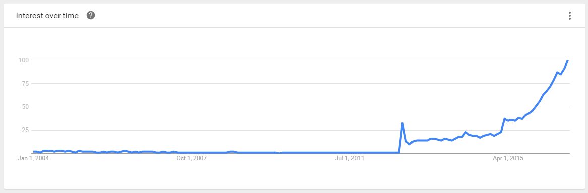

#Object Oriented Programming in Typescript

Typescript is nothing but a Super-set of JavaScript.

Typescript designed for developers who build large and complex apps in JavaScript. It inherits Object Oriented Programming concepts from languages such as C\# and Java.

Typescript is currently the hottest trend.

# Object Oriented
[Data from Google Trend](https://www.google.com/trends/explore?date=all&q=TypeScript)

