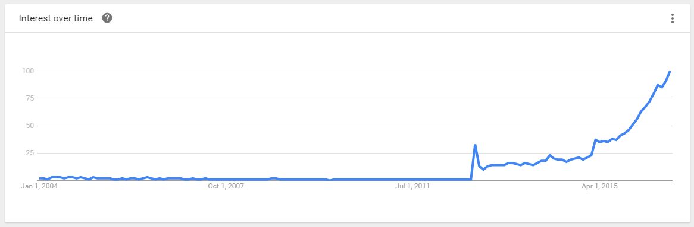
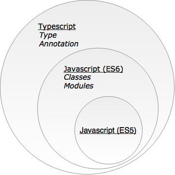

#Quick Start Typescript
  Typescript designed for developers who build large and complex apps in JavaScript. It inherits Object Oriented Programming concepts from languages such as C# and Java.

> Angular 2 itself written in Typescript. Developers recommends to use Typescript language for large project.
> 
> Angular 2 is one of the hottest frameworks right now and there are lot of example and tutorial written in Typescript.

[Data from Google Trend](https://www.google.com/trends/explore?date=all&q=TypeScript)

Typescript is nothing but a Super-set of JavaScript. Typescript compiler will automatically convert it to JavaScript.

